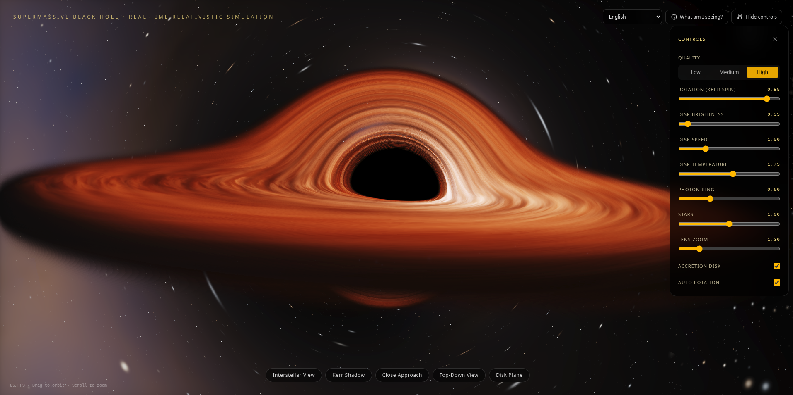

# Black Hole Simulation

Real-time relativistic simulation of a spinning supermassive black hole (Kerr metric) directly in the web browser using WebGL and GLSL shaders.

> 🌐 **Try it Live in your Browser:** [arrase.github.io/blackhole](https://arrase.github.io/blackhole/)



---

## 🌌 What is Gargantua?

**Gargantua** is an interactive web experience recreating the visual appearance of a spinning supermassive black hole, inspired by general relativity equations and the scientific visualization seen in Christopher Nolan's *Interstellar*.

Using GPU-accelerated ray marching, the simulation bends light rays around the black hole to accurately render extreme astrophysical phenomena in real time at 60+ FPS.

---

## ✨ Key Features

- **Real-Time Relativistic Physics:**
  - **Kerr Metric & Frame Dragging:** Models spacetime drag (Lense-Thirring effect) caused by the black hole's rotation (*spin* $a$), producing a characteristic asymmetric "D"-shaped shadow.
  - **Extreme Gravitational Lensing:** Strong gravity bends photons around the event horizon, projecting distorted views of the accretion disk both above and below the central shadow.
  - **Relativistic Doppler Beaming:** Plasma moving toward the observer experiences intense blueshift and quartic luminous amplification ($\delta^4$), while the receding side dims and reddens.
  - **Photon Ring:** Ultra-fine bright ring formed by photons that loop multiple times before escaping to the observer.
  - **Innermost Stable Circular Orbit (ISCO) & Plunging Region:** Realistic gas dynamics transitioning from Keplerian orbits to free-fall spiraling toward the event horizon.
  - **Dynamic Cosmic Starfield:** Thousands of procedurally generated stars with realistic spectral color classes and a deep galactic dust band distorted by gravitational lensing.

- **Fully Interactive:**
  - Smooth 360° orbital camera control with pan, tilt, and zoom.
  - 5 instant cinematic camera presets.
  - Live adjustment panel for physics, accretion disk brightness, spin, and rendering quality.
  - Real-time FPS performance counter.

- **Full Internationalization:**
  - Translated into 45 languages with automatic browser language detection and saved preferences.

- **Lightweight & Portable:**
  - Bundled as a standalone single HTML file (`dist/index.html`). Runs offline with zero external dependencies or server requirements.

---

## 🎮 Controls & User Guide

### Camera Navigation
| Action | Mouse | Touchscreen |
|---|---|---|
| **Orbit / Rotate View** | Left-click + drag | Single-finger drag |
| **Zoom (In / Out)** | Mouse wheel | Two-finger pinch |

### Camera Presets (Bottom Bar)
- **Interstellar View:** Classic cinematic, slightly tilted angle.
- **Kerr Shadow:** Close-up equatorial perspective highlighting frame-dragging asymmetry.
- **Close Approach:** Tight orbit right near the edge of the event horizon.
- **Top-Down View:** Overhead perspective showcasing full accretion disk geometry.
- **Disk Plane:** Eye-level view along the disk to observe extreme gravitational light warping.

### Live Settings Panel (Top Right)
- **Quality (Low / Medium / High):** Adjusts internal render resolution scale and ray marching step count to balance visual fidelity and GPU performance.
- **Rotation (Kerr Spin):** Modifies the spin parameter $a$ (from 0.00 to 0.95). Higher spin contracts the horizon and allows the disk to plunge much closer to the center.
- **Disk Brightness:** Controls plasma luminosity and radiant glow.
- **Disk Speed:** Adjusts the orbital flow rate of the accretion disk.
- **Photon Ring:** Enhances the brightness of secondary photon crossings.
- **Stars:** Regulates starfield density and brightness.
- **Lens Zoom (FOV):** Adjusts the camera's optical field of view.
- **Auto Rotation:** Toggles continuous cinematic orbital rotation.

### "What am I seeing?" Button
Opens a quick in-app guide detailing the astrophysical principles behind each visual element on screen.

---

## 🖥️ System Requirements

- Any modern web browser with **WebGL** support (Google Chrome, Mozilla Firefox, Microsoft Edge, Safari, Brave, Opera, etc.).
- Integrated or dedicated GPU with hardware acceleration enabled.
- Fully compatible with desktop systems (Linux, macOS, Windows) and mobile devices (iOS, Android).

---

## 🚀 How to Run the Simulation

### Option 1: Open the Standalone Build (Recommended)
If you have the compiled version (`dist/index.html`):
1. Open `dist/index.html` directly in your web browser (double-click or drag into any browser window).
2. No installation, server, or internet connection required.

### Option 2: Run from Source
To run or build the project locally using Node.js:

```bash
# 1. Install dependencies
npm install

# 2. Start local development server
npm run dev

# 3. Build standalone single-file distribution
npm run build
```

---

## 📚 Scientific References

- **Kerr, R. P. (1963):** *Gravitational Field of a Spinning Mass as an Example of Algebraically Special Metrics*.
- **Bardeen, J. M., Press, W. H., & Teukolsky, S. A. (1972):** *Rotating Black Holes: Locally Nonrotating Frames, Energy Extraction, and Scalar Synchrotron Radiation*.
- **James, O., von Tunzelmann, E., Franklin, P., & Thorne, K. S. (2015):** *Gravitational Lensing by Spinning Black Holes in Astrophysics, and in the Movie Interstellar*.
